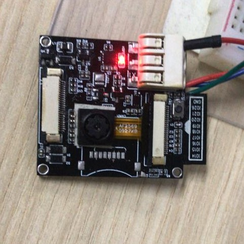

# ESP32S2 Camera + UDP Socket stream

ESP32S2 with OV2640 Camera udp stream example, an upgraded version of my [websockets example](https://github.com/wms2537/esp32s2-camera). JPEG images captured from camera is streamed to server via udp socket. User can view the stream at browser. Current implementation uses two sepatate tasks for capturing frames and sending them to the server, and can achieve around 24 fps.

Code is written with esp-idf.

## Backend
The backend is based on my [Python UDP Socket Server](https://github.com/wms2537/python-udp-mjpeg-server).

## Getting Started
### Hardware
This schematic contains an e-paper module used [here](https://github.com/wms2537/esp32s2-epaper-qr). You can ignore it. 

I designed a pcb for it.

### Code
Use `kconfig` to set the following
- `WIFI_SSID`, your wifi SSID
- `WIFI_PASS`, your wifi password
- `IPV4_ADDR`, your server address (you can also choose to use `IPV6_ADDR` and set the `IP_MODE` to `IPV6`)
- `PORT`, port of your server.

Start backend server and view stream from browser `http://localhost:3000`